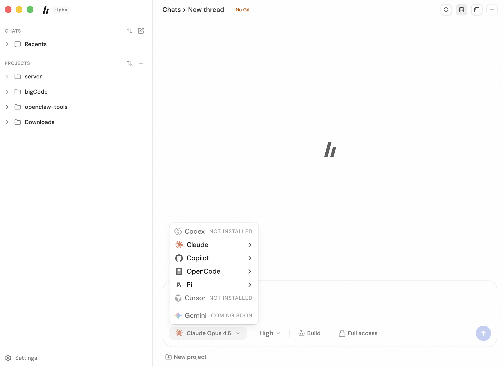
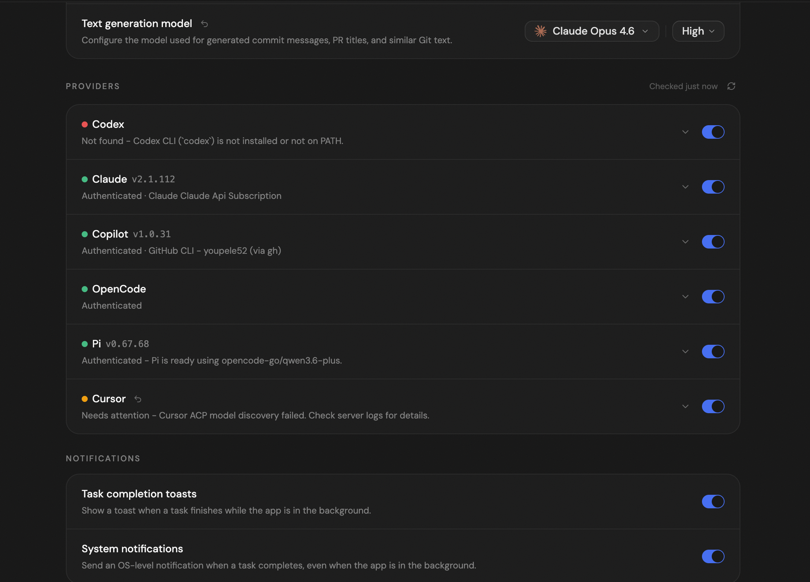

# bigCode

<p align="center">
  
</p>

A coding workspace for running AI coding agents through a fast desktop or web UI.

## Features

- **Multi-provider support** — Switch between Codex, Claude, Copilot, OpenCode, Pi, Cursor, and more
- **Desktop & Web** — Native Electron desktop app or lightweight web UI
- **Real-time streaming** — Live output with file changes, terminal commands, and reasoning
- **Full access mode** — Auto-approve commands and file edits for autonomous coding
- **Built-in terminal** — Integrated shell access alongside your agent conversations

<p align="center">
  
</p>

## Quick Install

### Desktop App

#### macOS / Linux

```bash
curl -fsSL https://raw.githubusercontent.com/youpele52/bigCode/main/apps/marketing/public/install.sh | sh
```

#### Windows

```powershell
powershell -NoProfile -ExecutionPolicy Bypass -Command "irm https://raw.githubusercontent.com/youpele52/bigCode/main/apps/marketing/public/install.ps1 | iex"
```

Or download directly from [GitHub Releases](https://github.com/youpele52/bigCode/releases).

### From Source

```bash
git clone https://github.com/youpele52/bigCode.git
cd bigCode
bun install
bun dev
```

Open `http://localhost:5733` in your browser.

For desktop development:

```bash
bun dev:desktop
```

## Provider Setup

bigCode supports multiple AI coding agents. Configure at least one in **Settings → Providers**:

| Provider | Setup |
|----------|-------|
| **Claude** | Install Claude Code: `npm i -g @anthropic-ai/claude-code`, then `claude auth login` |
| **Copilot** | Authenticate via GitHub CLI: `gh auth login` |
| **Codex** | Install Codex CLI and run `codex login` |
| **OpenCode** | See [OpenCode docs](https://opencode.ai) |
| **Pi** | Bundled — no additional setup needed |
| **Cursor** | Install [Cursor](https://cursor.sh) |

Provider status is checked in real-time and displayed in Settings. Each provider can be toggled on or off independently.

<p align="center">
  
</p>

## Desktop vs Web

| | Desktop | Web |
|---|---|---|
| **Installation** | Native installer | `bun dev` or self-hosted |
| **Server** | Bundled — runs locally | Requires separate server |
| **Native features** | OS notifications, system tray | Browser-based only |
| **Best for** | Everyday use | Development, self-hosting |

## Documentation

- [AGENTS.md](./AGENTS.md) — Development guide
- [CONTRIBUTING.md](./CONTRIBUTING.md) — Contribution guidelines
- [docs/release.md](./docs/release.md) — Release workflow & signing
- [docs/observability.md](./docs/observability.md) — Observability setup

## Development

```bash
# Full dev stack (server + web)
bun dev

# Individual apps
bun dev:server
bun dev:web
bun dev:desktop

# Run checks
bun fmt
bun lint
bun typecheck
bun run test   # Use this, not "bun test"
```

### Desktop Packaging

```bash
bun dist:desktop:dmg:arm64   # macOS Apple Silicon
bun dist:desktop:dmg:x64     # macOS Intel
bun dist:desktop:linux       # Linux AppImage
bun dist:desktop:win         # Windows NSIS installer
```

### Publishing a Release

Releases are published automatically when you push a version tag:

```bash
git tag v0.1.611
git push origin v0.1.611
```

The `.github/workflows/release.yml` workflow builds artifacts for all platforms and creates a GitHub Release. Manual triggers available via GitHub Actions UI.

See [docs/release.md](./docs/release.md) for detailed setup.

## Status

Early alpha — expect breaking changes.

We're not accepting contributions yet. See [CONTRIBUTING.md](./CONTRIBUTING.md) for details.

Need help? Join the [Discord](https://discord.gg/jn4EGJjrvv).
